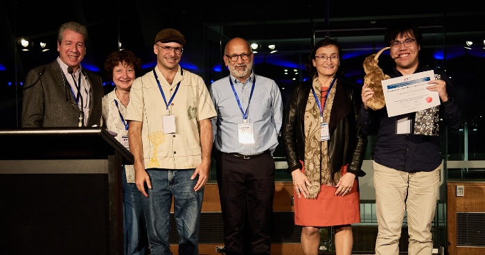

PhD student [Chenyuan Zhang,](https://cis.unimelb.edu.au/people/students/chenyuan-zhang) under the supervision of [Associate Professor Nir Lipovetzky](https://findanexpert.unimelb.edu.au/profile/565558-nir-lipovetzky), from the School of Computing and Information Systems, and a colleague from the School of Psychological Sciences, Professor Charles Kemp, has won the prestigious [Best Student Paper Award](https://www.aamas2024-conference.auckland.ac.nz/awards/best-paper-awards/) at the [2024 International Conference on Autonomous Agents and Multi-Agent Systems](https://www.aamas2024-conference.auckland.ac.nz/) (AAMAS).

AAMAS is the largest and most influential conference in the area of agents and multiagent systems. The conference aims to bring together researchers and practitioners in all areas of agent technology and to provide a single, high-profile, internationally renowned forum for research in the theory and practice of autonomous agents and multiagent systems. AAMAS is the flagship conference of the non-profit [International Foundation for Autonomous Agents and Multiagent Systems](https://www.ifaamas.org/) (IFAAMAS).

Chenyuan's paper, "Human Goal Recognition as Bayesian Inference: Investigating the Impact of Actions, Timing and Goal Solvability," was selected from over 1,000 submissions, of which only 200 were accepted for presentation. Among the three finalist papers, Chenyuan's work was ultimately honoured with the Pragnesh Jay Modi Best Paper Award at the conference banquet.

"This recognition is a significant milestone in our ongoing efforts to advance the field of goal recognition and AI, and we look forward to continued progress and collaboration," Chenyuan said.

 _General Chair Jaime Simão Sichman, Program Chair Natasha Alechina, Associate Professor Nir Lipovetzky, General Chair Mehdi Dastani, Program Chair Virginia Dignum and Chenyuan Zhang. (Picture: Supplied)_

Chenyuan's study involves analysing human responses to goal-recognition problems within the Sokoban domain, which is a puzzle video game in which the player pushes boxes around in a warehouse, trying to get them to storage locations.

Goal recognition is a fundamental cognitive process that enables individuals to infer intentions based on available cues. Traditional goal recognition algorithms typically rely solely on observed actions. However, this research leverages a [Bayesian framework](https://www.sciencedirect.com/topics/computer-science/bayesian-framework) to explore how actions, timing and goal solvability collectively influence goal recognition.

Findings revealed that while actions are deemed most crucial, the timing of these actions and the solvability of goals also play significant roles, particularly when actions alone do not provide sufficient information. This nuanced understanding allowed the development of a goal recognition model that aligns more closely with human inference processes than existing algorithms.

The paper provides new insights into human goal recognition and marks a significant step toward creating AI models that exhibit more human-like cognitive abilities.

"This achievement is also a testament to the power of interdisciplinary collaboration, bringing together expertise from the School of Psychological Sciences and the field of artificial intelligence at the School of Computing and Information Systems. It underscores the potential of cross-Faculty partnerships to drive innovative research and yield groundbreaking results," Associate Professor Lipovetzky said.

We extend our heartfelt congratulations to Chenyuan for this remarkable achievement!

**Read Chenyuan's full paper here:** [Abstract & PDF](/publication/zhang-2024-human)

**Appeared @ UoM:**[ FEIT eBulletin news](https://staff.unimelb.edu.au/engineering/news)
