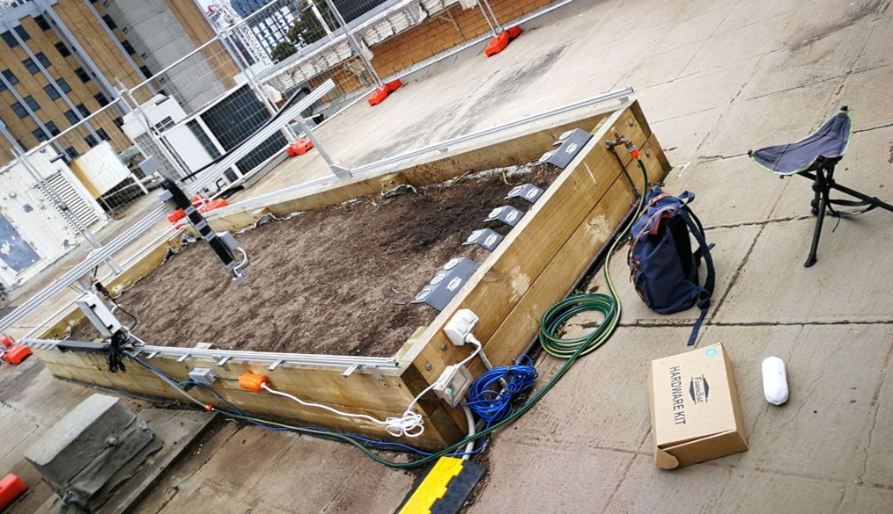
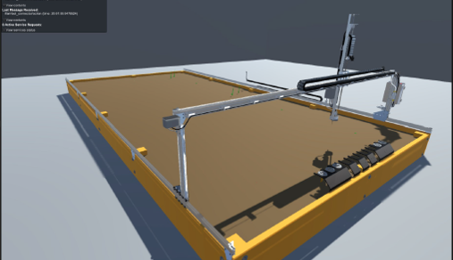
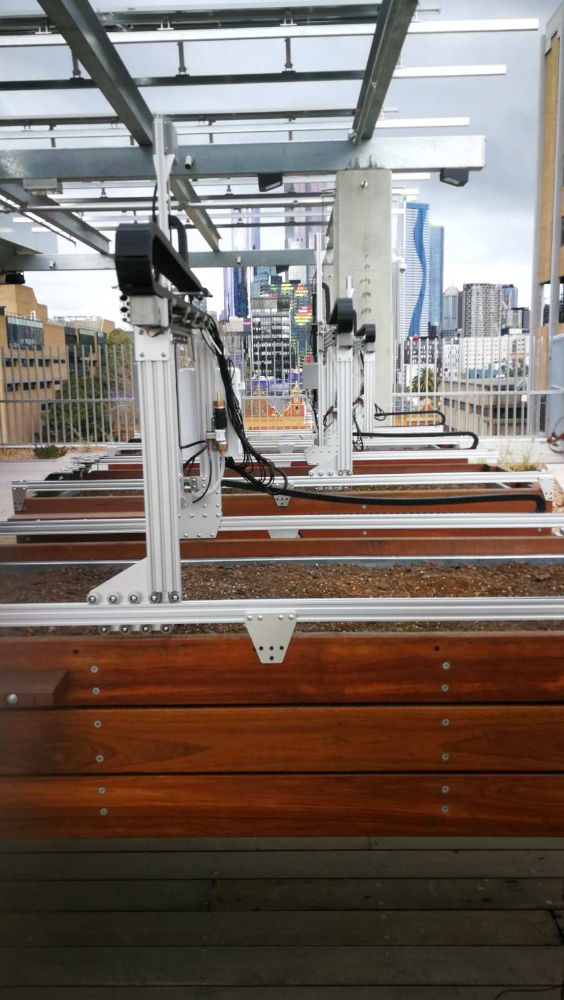
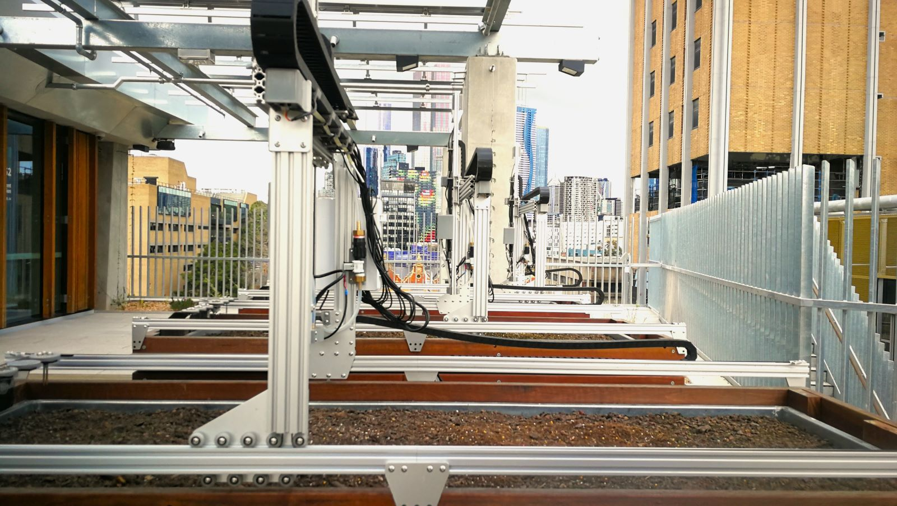
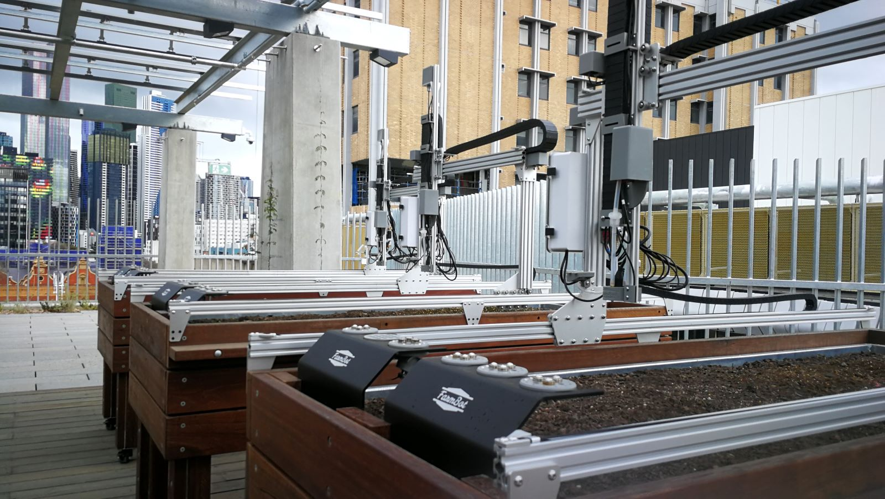
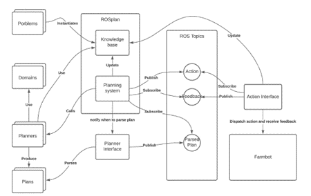

Farm.bot is an open-source 3-axis cartesian robot. We are using this platform at the Parkville campus to study the development of new sensors for agriculture, automate the experiments, and develop algorithms that autonomously monitor plants' physiology and actuate to maintain a set of targets. We have developed a unity simulator, and integrated AI planners to automatically synthesise high level controllers.

Key Characteristics:
 - 3-axis cartesian robot
 - Open Source Hardware and Software

Current Research Objectives:
- Integration of AI Planning algorithms to generate goal oriented Farm.bot behaviours
- Development of new sensors for agriculture
- Development of new algorithms to monitor and change plant physiology
- Development of a Digital Twin

We aim to create automated and replicable lab experiments with the platform.

## Student Precinct
The Student Precinct has supported our lab at CIS and FVAS to support interdisciplinary student projects. 

## Farm.Bot E-nose senosr integration

Watch the video below for a 3 minutes introduction about the new Farm.bot E-nose.

 -->

## Farm.Bot Unity Simulator

The Unity Simulator controlled by AI Planners was developed as a Master research project by Jiayuan during the COVID period, while we didn't have access to the physical platform.



Likn to the [github codebase](https://github.com/The-Kharsair-Empire/ROSfarm)

Jiayuan's Master Thesis is [availabe online as a PDF](./MCompSci100Thesis_JiayuanChang.pdf)

## Interested in working with the Farm.bots?

Reach out to Dr. Nir Lipovetzky and A/prof. Sigfredo Fuentes.